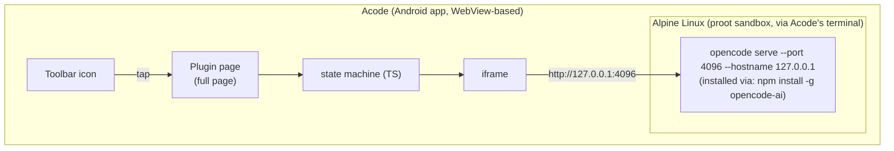
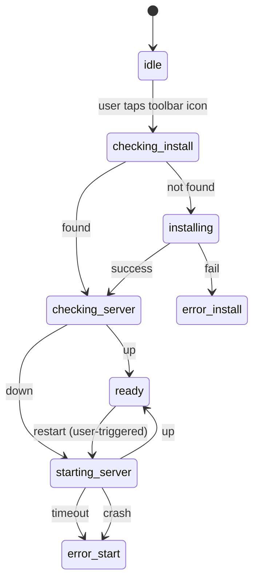

# Acode-OpenCode Plugin — Technical Spec

## 1. Summary

An Acode plugin that runs OpenCode (AI coding agent) as a background HTTP server
inside Acode's built-in Alpine Linux terminal, and displays OpenCode's web UI
in a full-page iframe, launched from a dedicated toolbar icon.

The OpenCode web UI natively supports browsing and switching between any
folders at runtime — no server restart or pre-configured project path needed.

---

## 2. Architecture



Communication with Alpine happens only through Acode's `terminal` module
(`Executor.execute`), never a custom bridge. The iframe talks to the server
directly over loopback HTTP — same-origin-style embedding, no CORS needed
since we're loading the full page, not fetching cross-origin data into JS.
The lightweight health-check ping uses `cordova.plugin.http` (native stack,
CORS-free) with a `fetch({ mode: 'no-cors' })` fallback for non-device runs.

---

## 3. Constraints (things that are true regardless of preference)

**C1 — Server runs from any directory.**
The OpenCode web UI lets users open and switch between any folders at runtime.
There is no need to `cd` into a project directory before starting the server.

**C2 — Fixed port, not dynamic.**
`opencode serve`/`opencode web` auto-assign a random port unless told
otherwise. The plugin always launches with `--port 4096 --hostname 127.0.0.1`
so the iframe `src` never has to be discovered at runtime.

**C3 — `Executor.execute` is blocking, not streaming.**
It resolves only after the invoked command exits. Long-running processes
(the server itself) must be explicitly backgrounded and detached
(`nohup … & disown`), or the call never returns and the plugin hangs.

**C4 — No install-time bun dependency.**
`npm install -g opencode-ai` distributes a prebuilt platform binary via
npm (similar to how `esbuild` ships), so Alpine only needs `nodejs` + `npm`.
Bun is not required on-device.

**C5 — Loopback only.**
Server binds `127.0.0.1`, never `0.0.0.0`. No `OPENCODE_SERVER_PASSWORD` is
set for MVP — acceptable only because the server is unreachable outside the
device itself. Do not change the hostname binding without adding auth.

**C6 — Single server instance.**
Only one `opencode serve` process runs at a time. Restart is available as
a recovery action (e.g. after crash or config change), but there is no
need to restart to switch projects — the web UI handles folder navigation.

---

## 4. State machine



`ready` renders the iframe. Any `error` state shows the relevant log tail
and a retry action. `restart` (user-triggered) re-enters at
`resolving-path`.

---

## 5. Module breakdown (`src/`)

| Module | Responsibility |
|---|---|
| `main.ts` | Plugin entrypoint (`AcodePlugin` class), registers icon, orchestrates flow |
| `config.ts` | All named constants (port, URLs, commands, timeouts) |
| `types.ts` | `AppState` enum, `StateContext`, `ErrorInfo`, `StateListener` |
| `state.ts` | State machine: `transition()`, `onStateChange()`, `setError()`, `reset()` |
| `logger.ts` | Leveled logging: `createLogger()`, `setLogEnabled()`, `setLogLevel()`, `getLogLevel()` |
| `error.ts` | `extractErrorInfo()` — normalizes unknown errors into `{ summary, logTail }` |
| `terminal/executor.ts` | Thin wrapper around `acode.require('terminal').Executor` (`execute(command, alpine)`) |
| `opencode/install.ts` | `checkInstalled()`, `installOpenCode()` — npm-based installation into Alpine |
| `opencode/health.ts` | `isServerUp()` — Cordova Advanced HTTP probe of `/global/health` |
| `opencode/server.ts` | `buildStartCommand()`, `startServer()`, `waitForReady()`, `stopServer()`, `restartServer()` |
| `ui/index.ts` | `render()` orchestrator dispatching to one render function per `AppState` |
| `ui/components.ts` | Vanilla DOM factory functions: spinner, iframe, header bar, error display |

---

## 6. Key commands reference

```bash
# one-time bootstrap (Phase 2)
apk add --no-cache nodejs npm && npm install -g opencode-ai

# check installed
which opencode

# start server, backgrounded and detached
nohup opencode serve --port 4096 --hostname 127.0.0.1 \
  > /tmp/opencode.log 2>&1 & disown

# health check (JS side, not shell)
# primary: cordova.plugin.http.get('http://127.0.0.1:4096/global/health', ...)
# fallback (tests/dev only): fetch('http://127.0.0.1:4096/global/health', { mode: 'no-cors' })

# best-effort stop before restart
pkill -f "opencode serve"
```

---

## 7. Explicit non-goals (MVP)

- SAF-opened project support
- Multi-server / multi-port concurrency
- Custom theming or CSS scaling of the OpenCode web UI
- Server auth / password protection
- Auto-updating the `opencode-ai` package
- Streaming install progress (Executor doesn't support it — spinner only)

---

## 8. Resolved implementation notes

- `editorManager.activeFile.uri` provides the active file path; `resolveProjectPath()` extracts the directory portion via `lastIndexOf('/')`.
- Alpine proot may not survive extended backgrounding on all devices — the plugin detects this via the restart path and transparently re-launches the server.
- `opencode-ai` ships prebuilt ARM64 binaries via npm; confirmed working inside proot Alpine on ARM64 Android devices.
